# Database Diagram — Bus Booking System

> Render with: VS Code "Mermaid Preview" extension, [mermaid.live](https://mermaid.live), or GitHub (auto-renders Mermaid blocks).

```mermaid
erDiagram

    %% ─────────────── CORE ───────────────
    USER {
        ObjectId _id PK
        string   name
        string   email
        string   password
        string   phone
        string   role "user | admin"
        boolean  isEmailVerified
        boolean  isSuspended
        string   emailVerificationToken
        string   passwordResetToken
        Date     passwordResetExpires
        Date     lastLoginAt
        Date     createdAt
    }

    ROUTE {
        ObjectId _id PK
        string   from
        string   to
        string   duration
        number   distance
    }

    BUSDETAIL {
        ObjectId _id PK
        string   name
        string   registrationNumber
        string   busType "bus_45 | mini_bus | car | sleeper_30 | sleeper_40"
        number   totalSeats
        string[] amenities
        string[] images
        mixed    seatLayoutTemplate
    }

    DRIVER {
        ObjectId _id PK
        string   name
        string   phone
        string   licenseNumber
        string   vehicleNumber
        string   avatar
        string   status "active | inactive"
    }

    BUS {
        ObjectId _id PK
        ObjectId routeId FK
        ObjectId driverId FK
        ObjectId busDetailId FK
        Date     date
        string   departureTime
        string   arrivalTime
        string   busType
        string   busNumber
        number   totalSeats
        string[] bookedSeats
        string[] blockedSeats
        number   pricePerSeat
        string[] amenities
        string   departureStatus "scheduled | delayed | departed | cancelled"
        number   delayMinutes
        string   statusNote
        mixed    seatTierMultipliers "business / vip multipliers"
    }

    %% ─────────────── BOOKINGS ───────────────
    BOOKING {
        ObjectId _id PK
        ObjectId user FK
        ObjectId bus FK
        string[] seats
        mixed[]  passengers "name, age, gender, contactNumber"
        number   totalPrice
        number   discountAmount
        number   finalPrice
        string   promoCode
        string   boardingStop
        string   droppingStop
        string   status "pending | confirmed | cancelled | refunded"
        string   paymentStatus "pending | paid | refunded | failed"
        number   refundAmount
        string   refundStatus
        string   checkInStatus "pending | checked-in | boarded | no-show"
        Date     checkedInAt
        string   checkedInBy
        mixed    metadata "paymentMethod, agentId, guestEmail, note"
        Date     createdAt
    }

    PENDINGBOOKING {
        ObjectId _id PK
        string   userId
        string   busId
        string[] seats
        mixed[]  passengers
        number   totalPrice
        string   promoCode
        string   gateway "stripe | abaPayway"
        string   gatewaySessionId
        string   status "pending | paid | failed | expired"
        Date     expiresAt "TTL — auto-deleted after 30 min"
        string   createdBookingId
    }

    PROMOCODE {
        ObjectId   _id PK
        string     code
        string     type "percentage | fixed | free_ticket"
        number     value
        number     maxUses
        number     usedCount
        number     minBookingAmount
        number     maxDiscountAmount
        Date       validFrom
        Date       validUntil
        ObjectId[] applicableRoutes FK
        string[]   applicableBusTypes
        boolean    isActive
    }

    %% ─────────────── LOYALTY & RATINGS ───────────────
    LOYALTY {
        ObjectId _id PK
        ObjectId user FK "unique — 1 per user"
        string   tier "bronze | silver | gold | platinum"
        number   points
        number   lifetimePoints
        number   totalBookings
        number   totalSpent
        mixed[]  pointsHistory "points, type, description, bookingId, expiresAt"
        mixed    tierProgress "currentTierPoints, nextTierPoints, nextTier"
        mixed    metadata "lastActivityAt, consecutiveBookings, referralCount"
    }

    RATING {
        ObjectId _id PK
        ObjectId user FK
        ObjectId bus FK
        ObjectId booking FK "unique per booking"
        number   rating "1–5"
        string   review
        mixed    aspects "punctuality, cleanliness, staffBehavior, comfort"
        boolean  wouldRecommend
        boolean  isVerified
        string   response "operator reply"
        number   helpful
        number   notHelpful
        string   status "pending | approved | rejected"
    }

    %% ─────────────── NOTIFICATIONS & SUPPORT ───────────────
    NOTIFICATION {
        ObjectId _id PK
        ObjectId userId FK
        string   type "announcement | booking_confirmed | booking_cancelled | trip_update | system"
        string   title
        string   message
        boolean  read
        ObjectId busId FK
        ObjectId bookingId FK
        Date     createdAt "TTL — auto-deleted after 90 days"
    }

    WAITINGLIST {
        ObjectId _id PK
        ObjectId user FK
        ObjectId bus FK
        ObjectId route FK
        number   requestedSeats
        string   requestedDate
        string   requestedDepartureTime
        string   status "active | notified | booked | expired | cancelled"
        number   priority
        Date     notifiedAt
        Date     notificationExpiresAt
        Date     expiresAt "TTL — auto-deleted"
    }

    SUPPORTCONVERSATION {
        ObjectId _id PK
        ObjectId user FK
        string   subject
        string   status "open | resolved | closed"
        mixed[]  messages "sender, text, createdAt"
        Date     createdAt
    }

    LOSTFOUND {
        ObjectId _id PK
        string   refNumber "unique"
        ObjectId reportedBy FK
        ObjectId bookingId FK
        ObjectId busId FK
        ObjectId routeId FK
        string   reporterName
        string   reporterEmail
        string   reporterPhone
        Date     travelDate
        string   seatNumber
        string   itemName
        string   itemCategory "bag | electronics | clothing | documents | jewelry | money | keys | other"
        string   itemDescription
        string   color
        string   brand
        string   status "reported | under_review | found | returned | not_found | closed"
        string   adminNotes
        string   handledBy
        Date     returnedAt
    }

    %% ─────────────── FLEET MANAGEMENT ───────────────
    MAINTENANCE {
        ObjectId _id PK
        ObjectId busDetailId FK
        string   maintenanceType "oil_change | tire | brake | engine | inspection | electrical | bodywork | other"
        string   status "scheduled | in_progress | completed"
        Date     date
        number   cost
        string   workshop
        number   odometer
        Date     nextServiceDate
        string   description
    }

    INCIDENT {
        ObjectId _id PK
        ObjectId busDetailId FK
        string   incidentType "breakdown | accident | flat_tire | engine_failure | electrical | flood_damage | other"
        string   severity "low | medium | high"
        string   location
        string   description
        string   resolution
        string   status "open | resolved"
        number   cost
        string   reportedBy
        Date     date
    }

    FUELLOG {
        ObjectId _id PK
        ObjectId busDetailId FK
        ObjectId driverId FK
        Date     date
        number   liters
        number   pricePerLiter
        number   totalCost
        number   odometer
        string   station
    }

    %% ─────────────── HR / DRIVER MANAGEMENT ───────────────
    DRIVERSCHEDULE {
        ObjectId _id PK
        ObjectId driverId FK
        ObjectId busDetailId FK
        ObjectId busId FK
        Date     date
        string   shiftStart
        string   shiftEnd
        string   status "scheduled | active | completed | cancelled | no_show"
    }

    DRIVEREARNING {
        ObjectId _id PK
        ObjectId driverId FK
        ObjectId busDetailId FK
        Date     date
        number   regularTrips
        number   overtimeTrips
        number   basePay
        number   overtimeRate
        number   regularEarnings
        number   overtimeEarnings
        number   totalEarnings
    }

    EMPLOYEE {
        ObjectId _id PK
        string   name
        string   phone
        string   email
        string   role "driver | mechanic | ticket_agent | manager | accountant | other"
        string   department "operations | finance | maintenance | admin | customer_service"
        string   status "active | on_leave | resigned | terminated"
        Date     hireDate
        string   salaryType "monthly | daily"
        number   baseSalary
        number   allowanceTransport
        number   allowanceMeal
        number   allowanceHousing
    }

    PAYROLL {
        ObjectId _id PK
        ObjectId employeeId FK
        string   month "YYYY-MM"
        number   baseSalary
        number   totalAllowances
        number   totalDeductions
        number   bonus
        number   grossPay
        number   netPay
        string   status "draft | approved | paid"
        Date     paidAt
    }

    %% ─────────────── ANALYTICS & AUDIT ───────────────
    AUDITLOG {
        ObjectId _id PK
        string   entityType "booking | bus | route | user | promo_code | system"
        string   entityId
        string   action "create | update | delete | cancel | refund | login | logout"
        string   userId
        string   userName
        string   userEmail
        string   severity "low | medium | high | critical"
        mixed[]  changes "field, oldValue, newValue"
        Date     timestamp "TTL — auto-deleted after 1 year"
    }

    PAGEVIEW {
        ObjectId _id PK
        string   page
        string   referrer
        string   device "mobile | tablet | desktop"
        string   browser
        string   os
        string   sessionId
        string   country
        Date     createdAt
    }

    SETTINGS {
        ObjectId _id PK
        string   logoUrl
        string   businessName
        string   contactEmail
        string   supportPhone
        string   currency
        string   timezone
        number   maxSeatsPerBooking
        number   bookingCutoffMinutes
        number   cancellationWindowHours
        boolean  autoConfirm
        boolean  emailEnabled
        boolean  smsEnabled
        string   adminAlertEmail
        string   activeGateway "stripe | abaPayway | none"
        boolean  stripeEnabled
        boolean  abaEnabled
        boolean  twilioEnabled
    }

    %% ══════════════════════════════════
    %% RELATIONSHIPS
    %% ══════════════════════════════════

    %% Core booking flow
    ROUTE       ||--o{ BUS              : "has trips"
    DRIVER      ||--o{ BUS              : "assigned to"
    BUSDETAIL   ||--o{ BUS              : "vehicle template"
    USER        ||--o{ BOOKING          : "makes"
    BUS         ||--o{ BOOKING          : "has"
    BUS         ||--o{ PENDINGBOOKING   : "pending for"

    %% Promo codes
    ROUTE       ||--o{ PROMOCODE        : "applies to (optional)"

    %% Loyalty & Ratings
    USER        ||--o| LOYALTY          : "has (1-to-1)"
    USER        ||--o{ RATING           : "writes"
    BUS         ||--o{ RATING           : "receives"
    BOOKING     ||--o| RATING           : "rated once"

    %% Waitlist
    USER        ||--o{ WAITINGLIST      : "joins"
    BUS         ||--o{ WAITINGLIST      : "has queue"
    ROUTE       ||--o{ WAITINGLIST      : "for route"

    %% Notifications
    USER        ||--o{ NOTIFICATION     : "receives"
    BUS         ||--o{ NOTIFICATION     : "triggers"
    BOOKING     ||--o{ NOTIFICATION     : "triggers"

    %% Support & Lost Found
    USER        ||--o{ SUPPORTCONVERSATION : "opens ticket"
    USER        ||--o{ LOSTFOUND        : "reports item"
    BOOKING     ||--o| LOSTFOUND        : "related booking"
    BUS         ||--o{ LOSTFOUND        : "lost on"
    ROUTE       ||--o{ LOSTFOUND        : "on route"

    %% Fleet management
    BUSDETAIL   ||--o{ MAINTENANCE      : "has"
    BUSDETAIL   ||--o{ INCIDENT         : "has"
    BUSDETAIL   ||--o{ FUELLOG          : "has"
    BUSDETAIL   ||--o{ DRIVEREARNING    : "earnings for"
    BUSDETAIL   ||--o{ DRIVERSCHEDULE   : "scheduled on"

    %% Driver management
    DRIVER      ||--o{ DRIVEREARNING    : "earns"
    DRIVER      ||--o{ DRIVERSCHEDULE   : "scheduled"
    DRIVER      ||--o{ FUELLOG          : "logs fuel"

    %% HR
    EMPLOYEE    ||--o{ PAYROLL          : "has payroll"
```

---

## Collection Summary

| Collection | Purpose | Key Relations | TTL |
|---|---|---|---|
| **User** | Passengers & admins | — | — |
| **Route** | Origin→Destination templates | — | — |
| **BusDetail** | Physical vehicle registry | — | — |
| **Driver** | Driver profiles | — | — |
| **Bus** | Scheduled trips | Route, Driver, BusDetail | — |
| **Booking** | Confirmed bookings | User, Bus | — |
| **PendingBooking** | Awaiting payment | userId, busId | 30 min |
| **PromoCode** | Discount codes | Route (optional) | — |
| **Loyalty** | Points & tier per user | User (1:1) | — |
| **Rating** | Post-trip reviews | User, Bus, Booking | — |
| **Notification** | In-app alerts | User, Bus, Booking | 90 days |
| **WaitingList** | Full-bus queue | User, Bus, Route | 7 days |
| **SupportConversation** | Customer support chat | User | — |
| **LostFound** | Lost item reports | User, Booking, Bus, Route | — |
| **Maintenance** | Vehicle service records | BusDetail | — |
| **Incident** | Vehicle incidents | BusDetail | — |
| **FuelLog** | Fuel consumption | BusDetail, Driver | — |
| **DriverSchedule** | Shift assignments | Driver, BusDetail, Bus | — |
| **DriverEarning** | Daily driver pay | Driver, BusDetail | — |
| **Employee** | All staff records | — | — |
| **Payroll** | Monthly payslips | Employee | — |
| **AuditLog** | Admin action trail | entityId (string ref) | 1 year |
| **PageView** | Anonymous analytics | — | — |
| **Settings** | System config (singleton) | — | — |
