# System Flowcharts — Bus Booking System

> Paste any chart into [mermaid.live](https://mermaid.live) or view with VS Code "Markdown Preview Mermaid Support" (`Ctrl+Shift+V`).

---

## 1. User Authentication Flow

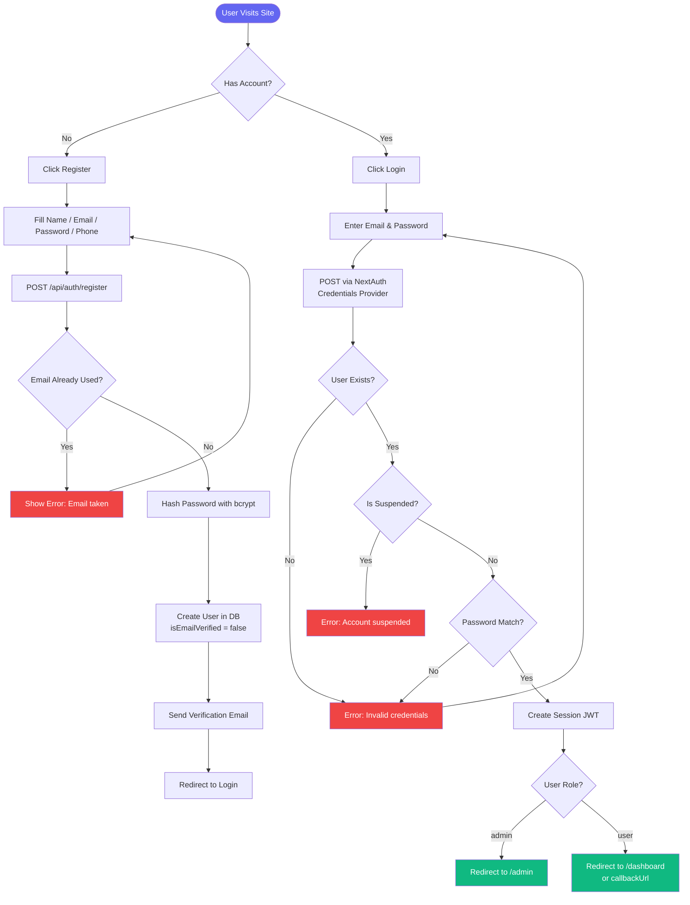

---

## 2. Bus Search & Results Flow

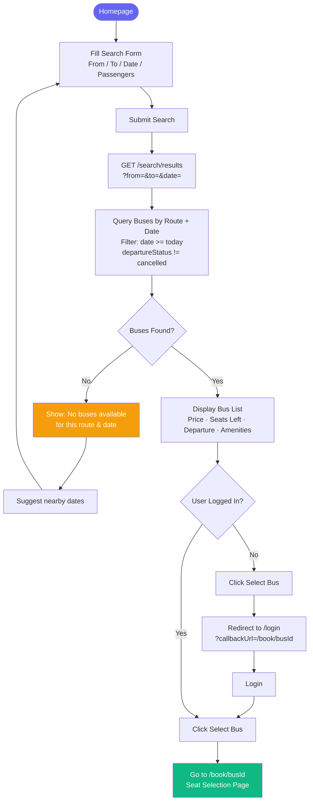

---

## 3. Seat Selection Flow

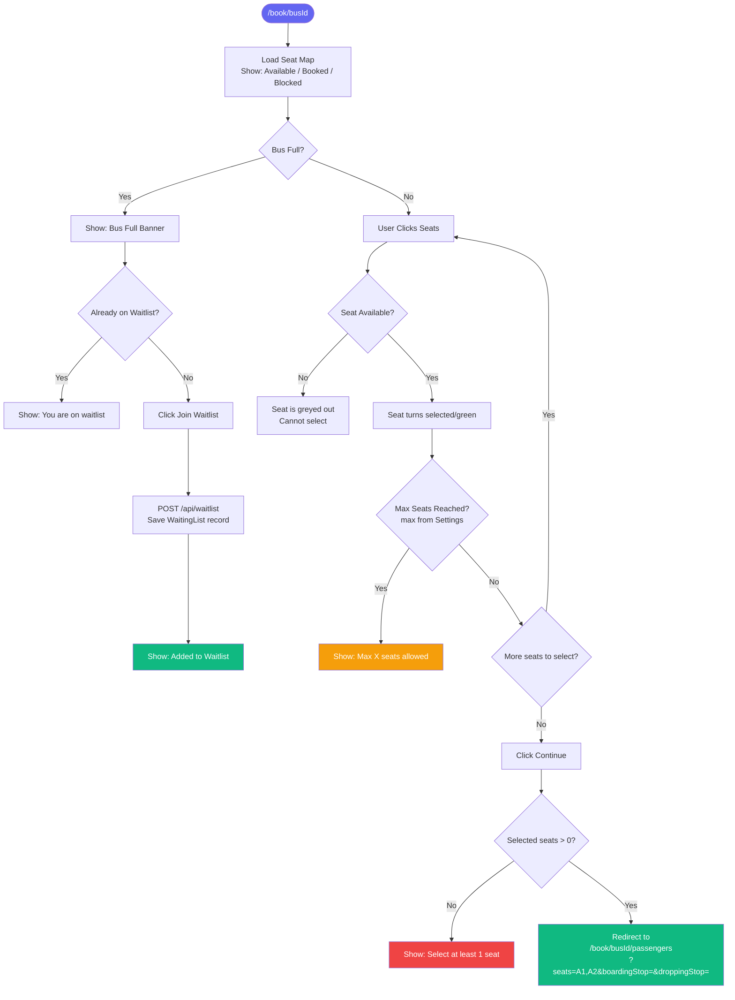

---

## 4. Passenger Details & Payment Flow

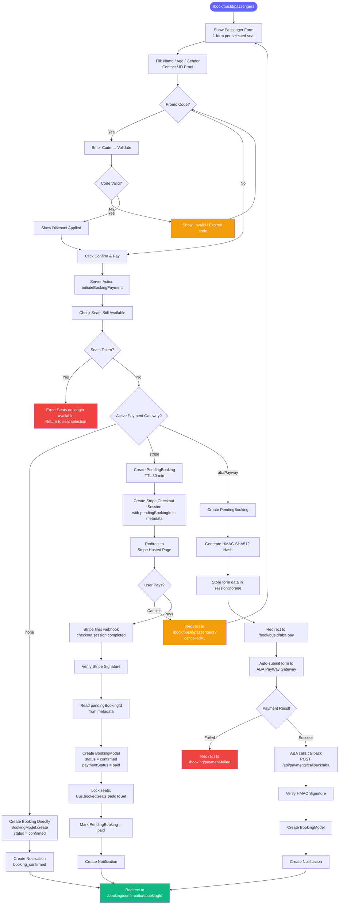

---

## 5. Booking Confirmation & Ticket Flow

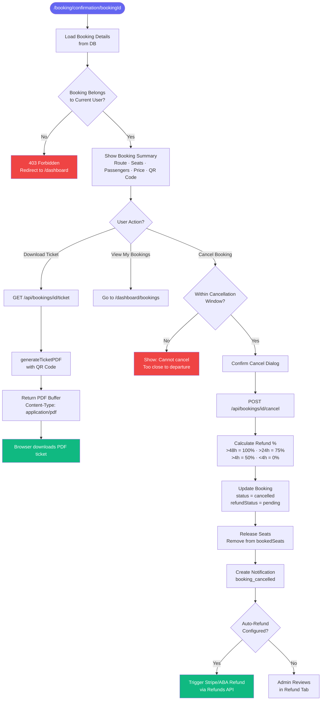

---

## 6. Admin — Bus & Route Management Flow

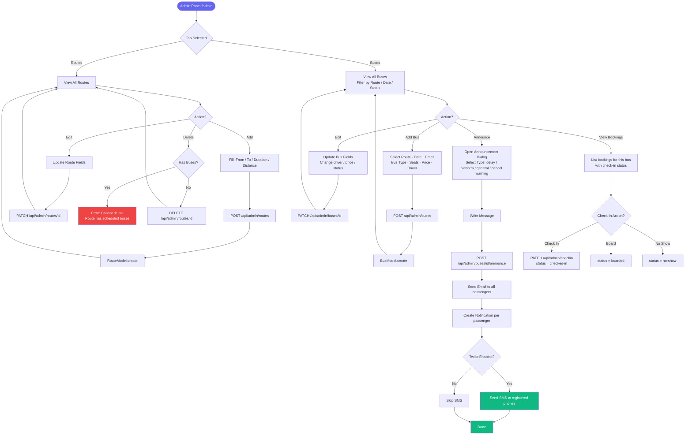

---

## 7. Notification Flow

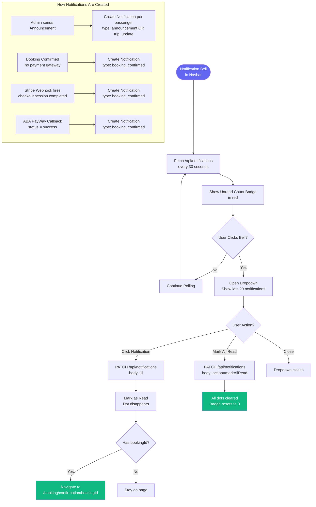

---

## 8. Admin Announcement & SMS Flow

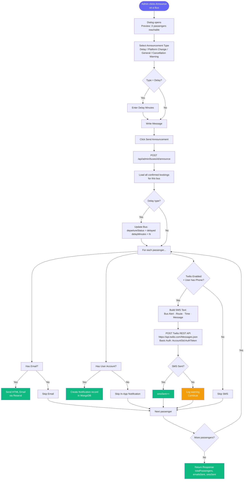

---

## 9. Admin — User & Booking Management Flow

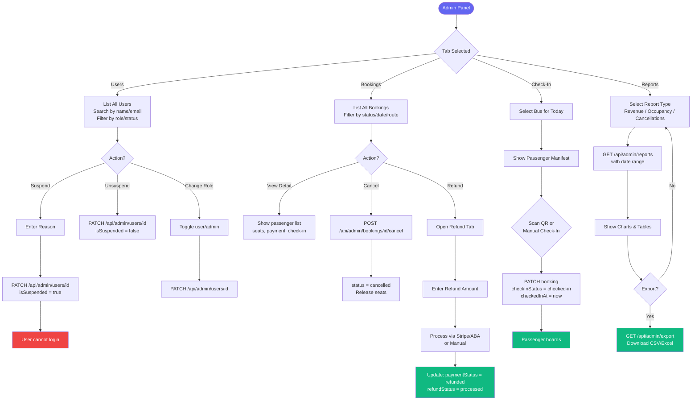

---

## 10. Loyalty Points Flow

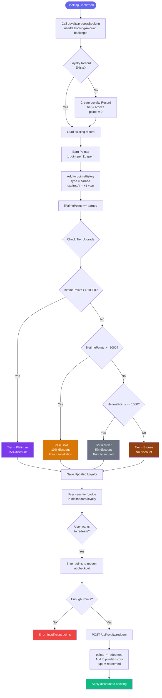

---

## 11. Lost & Found Flow

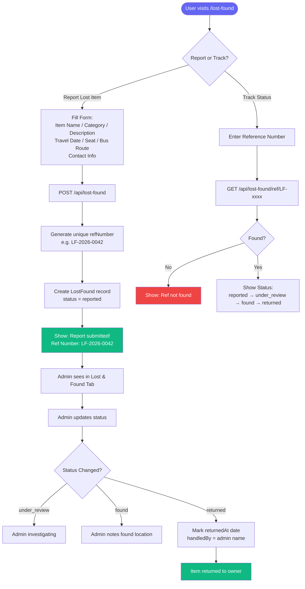

---

## 12. Support Chat Flow

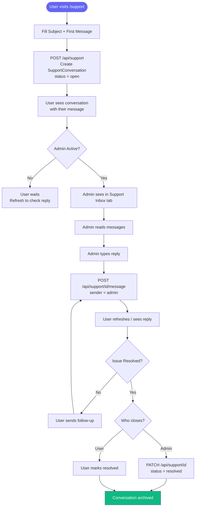
