# Bus Booking System — Complete Mermaid Flowcharts

---

## Overview

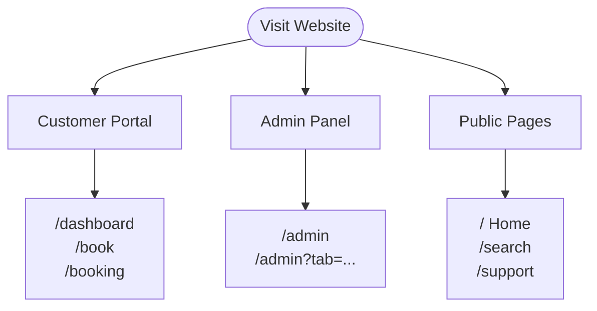
```mermaid
graph TD
    SITE([Visit Website]) --> CP[Customer Portal]
    SITE --> AP[Admin Panel]
    SITE --> PUB[Public Pages]

    CP --> CD["/dashboard\n/book\n/booking"]
    AP --> AD["/admin\n/admin?tab=..."]
    PUB --> PD["/ Home\n/search\n/support"]
```

---

## 1. User Authentication

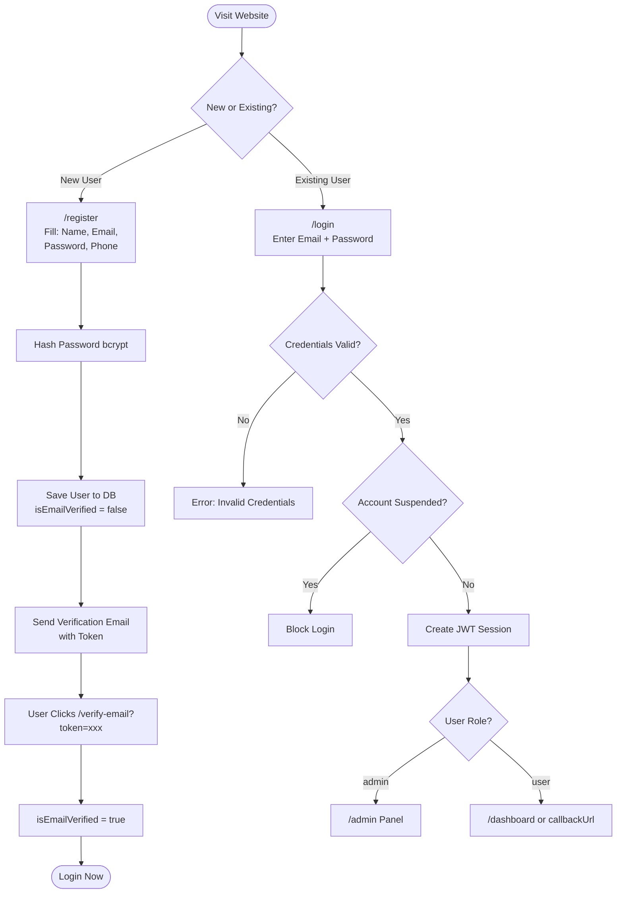
```mermaid
flowchart TD
    START([Visit Website]) --> SPLIT{New or Existing?}

    SPLIT -->|New User| REG["/register\nFill: Name, Email,\nPassword, Phone"]
    SPLIT -->|Existing User| LOGIN["/login\nEnter Email + Password"]

    REG --> HASH[Hash Password bcrypt]
    HASH --> SAVEUSER[Save User to DB\nisEmailVerified = false]
    SAVEUSER --> SENDEMAIL[Send Verification Email\nwith Token]
    SENDEMAIL --> CLICKLINK[User Clicks /verify-email?token=xxx]
    CLICKLINK --> VERIFIED[isEmailVerified = true]
    VERIFIED --> LOGINNOW([Login Now])

    LOGIN --> CREDCHECK{Credentials Valid?}
    CREDCHECK -->|No| ERRORCRED[Error: Invalid Credentials]
    CREDCHECK -->|Yes| SUSPENDED{Account Suspended?}
    SUSPENDED -->|Yes| BLOCK[Block Login]
    SUSPENDED -->|No| JWT[Create JWT Session]
    JWT --> ROLE{User Role?}
    ROLE -->|admin| ADMINPANEL["/admin Panel"]
    ROLE -->|user| DASHBOARD["/dashboard or callbackUrl"]
```

---

## 2. Bus Search & Results

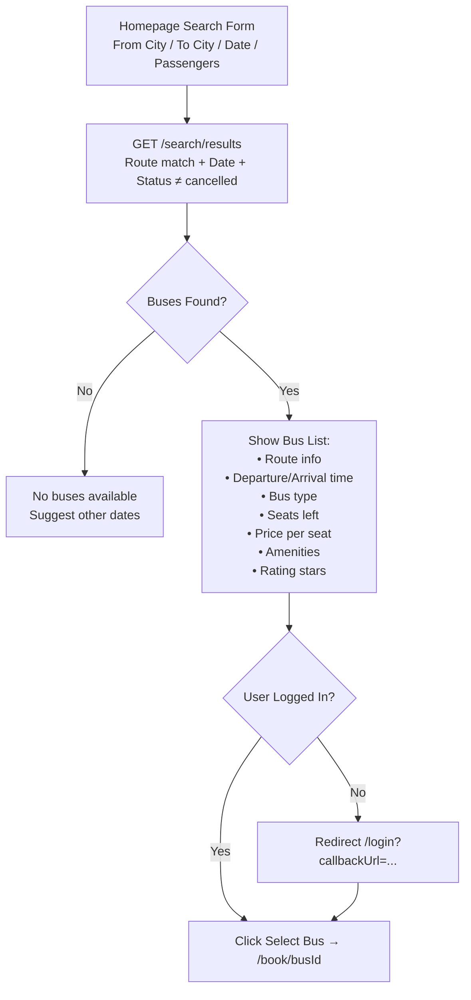
```mermaid
flowchart TD
    FORM[Homepage Search Form\nFrom City / To City / Date / Passengers]
    FORM --> SEARCH["GET /search/results\nRoute match + Date + Status ≠ cancelled"]
    SEARCH --> FOUND{Buses Found?}
    FOUND -->|No| NOBUS[No buses available\nSuggest other dates]
    FOUND -->|Yes| BUSLIST["Show Bus List:\n• Route info\n• Departure/Arrival time\n• Bus type\n• Seats left\n• Price per seat\n• Amenities\n• Rating stars"]
    BUSLIST --> LOGGEDIN{User Logged In?}
    LOGGEDIN -->|No| REDIRECT[Redirect /login?callbackUrl=...]
    LOGGEDIN -->|Yes| SELECTBUS[Click Select Bus → /book/busId]
    REDIRECT --> SELECTBUS
```

---

## 3. Seat Selection

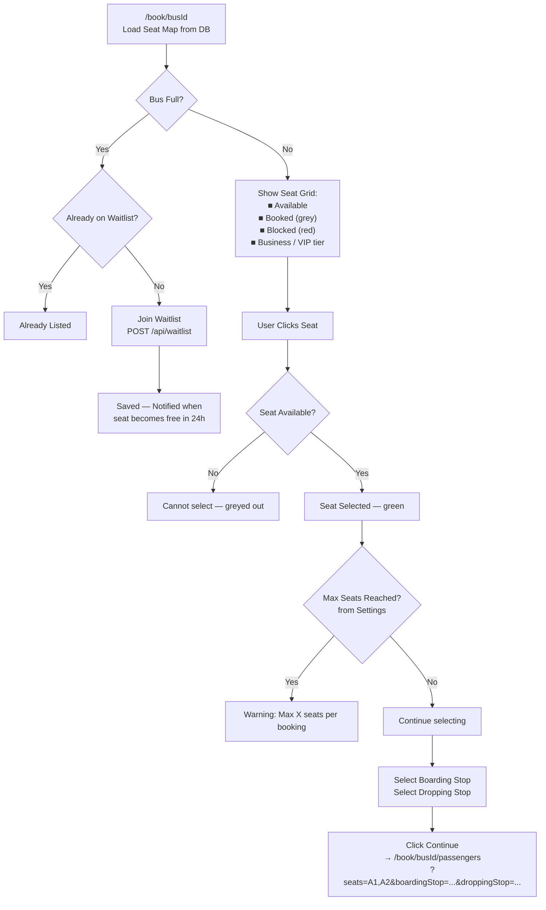
```mermaid
flowchart TD
    BOOKPAGE["/book/busId\nLoad Seat Map from DB"]
    BOOKPAGE --> FULL{Bus Full?}

    FULL -->|No| GRID["Show Seat Grid:\n■ Available\n■ Booked (grey)\n■ Blocked (red)\n■ Business / VIP tier"]
    FULL -->|Yes| WAITCHECK{Already on Waitlist?}
    WAITCHECK -->|Yes| ALREADYLISTED[Already Listed]
    WAITCHECK -->|No| JOINWAIT["Join Waitlist\nPOST /api/waitlist"]
    JOINWAIT --> WAITNOTIFY[Saved — Notified when\nseat becomes free in 24h]

    GRID --> CLICK[User Clicks Seat]
    CLICK --> AVAIL{Seat Available?}
    AVAIL -->|No| GREY[Cannot select — greyed out]
    AVAIL -->|Yes| SELECTED[Seat Selected — green]
    SELECTED --> MAXCHECK{Max Seats Reached?\nfrom Settings}
    MAXCHECK -->|Yes| WARN[Warning: Max X seats per booking]
    MAXCHECK -->|No| CONTINUE[Continue selecting]
    CONTINUE --> STOPS["Select Boarding Stop\nSelect Dropping Stop"]
    STOPS --> NEXT[Click Continue\n→ /book/busId/passengers\n?seats=A1,A2&boardingStop=...&droppingStop=...]
```

---

## 4. Passenger Details & Payment

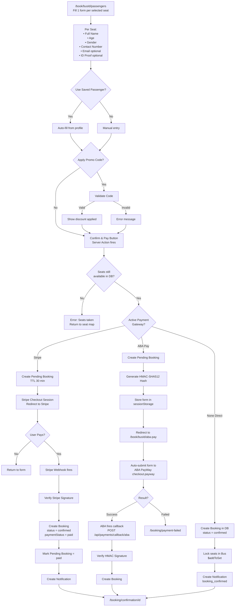
```mermaid
flowchart TD
    PASSENGERPAGE["/book/busId/passengers\nFill 1 form per selected seat"]
    PASSENGERPAGE --> FIELDS["Per Seat:\n• Full Name\n• Age\n• Gender\n• Contact Number\n• Email optional\n• ID Proof optional"]

    FIELDS --> SAVED{Use Saved Passenger?}
    SAVED -->|Yes| AUTOFILL[Auto-fill from profile]
    SAVED -->|No| MANUAL[Manual entry]
    AUTOFILL --> PROMO
    MANUAL --> PROMO

    PROMO{Apply Promo Code?}
    PROMO -->|Yes| VALIDATE[Validate Code]
    VALIDATE -->|Valid| DISCOUNT[Show discount applied]
    VALIDATE -->|Invalid| ERRMSG[Error message]
    PROMO -->|No| CONFIRM
    DISCOUNT --> CONFIRM
    ERRMSG --> CONFIRM

    CONFIRM[Confirm & Pay Button\nServer Action fires]
    CONFIRM --> SEATCHECK{Seats still\navailable in DB?}
    SEATCHECK -->|No| SEATERR[Error: Seats taken\nReturn to seat map]
    SEATCHECK -->|Yes| GATEWAY{Active Payment\nGateway?}

    GATEWAY -->|Stripe| STRIPEPEND["Create Pending Booking\nTTL 30 min"]
    GATEWAY -->|ABA Pay| ABAPEND[Create Pending Booking]
    GATEWAY -->|None Direct| DIRECT["Create Booking in DB\nstatus = confirmed"]

    STRIPEPEND --> STRIPECO[Stripe Checkout Session\nRedirect to Stripe]
    STRIPECO --> USERPAYS{User Pays?}
    USERPAYS -->|No| RETURNFORM[Return to form]
    USERPAYS -->|Yes| STRIPEWEBHOOK[Stripe Webhook fires]
    STRIPEWEBHOOK --> VERIFYSIG[Verify Stripe Signature]
    VERIFYSIG --> CONFIRMBOOKING_S["Create Booking\nstatus = confirmed\npaymentStatus = paid"]
    CONFIRMBOOKING_S --> MARKPAID_S[Mark Pending Booking = paid]
    MARKPAID_S --> NOTIF_S[Create Notification]
    NOTIF_S --> CONFPAGE["/booking/confirmation/id"]

    ABAPEND --> HMAC[Generate HMAC-SHA512 Hash]
    HMAC --> SESSION[Store form in sessionStorage]
    SESSION --> ABAPAGE[Redirect to /book/busId/aba-pay]
    ABAPAGE --> AUTOSUBMIT[Auto-submit form to\nABA PayWay checkout.payway]
    AUTOSUBMIT --> ABARESULT{Result?}
    ABARESULT -->|Failed| PAYFAILED["/booking/payment-failed"]
    ABARESULT -->|Success| ABACALLBACK["ABA fires callback\nPOST /api/payments/callback/aba"]
    ABACALLBACK --> VERIFYHMAC[Verify HMAC Signature]
    VERIFYHMAC --> CONFIRMBOOKING_A[Create Booking]
    CONFIRMBOOKING_A --> CONFPAGE

    DIRECT --> LOCKSEATS["Lock seats in Bus\n$addToSet"]
    LOCKSEATS --> NOTIF_D[Create Notification\nbooking_confirmed]
    NOTIF_D --> CONFPAGE
```

---

## 5. Booking Confirmation & Ticket

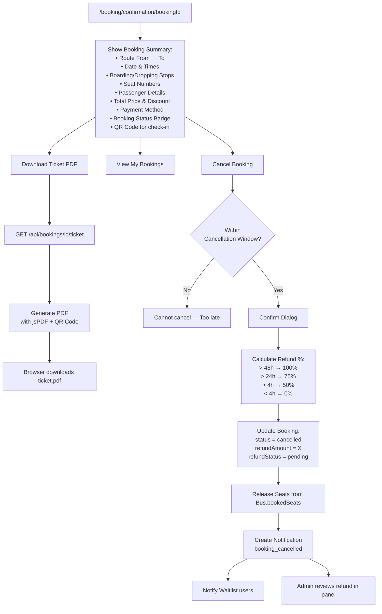
```mermaid
flowchart TD
    CONFPAGE["/booking/confirmation/bookingId"]
    CONFPAGE --> SUMMARY["Show Booking Summary:\n• Route From → To\n• Date & Times\n• Boarding/Dropping Stops\n• Seat Numbers\n• Passenger Details\n• Total Price & Discount\n• Payment Method\n• Booking Status Badge\n• QR Code for check-in"]

    SUMMARY --> DL[Download Ticket PDF]
    SUMMARY --> VIEW[View My Bookings]
    SUMMARY --> CANCEL[Cancel Booking]

    DL --> TICKETAPI["GET /api/bookings/id/ticket"]
    TICKETAPI --> GENPDF[Generate PDF\nwith jsPDF + QR Code]
    GENPDF --> DOWNLOAD[Browser downloads ticket.pdf]

    CANCEL --> WINDOW{Within\nCancellation Window?}
    WINDOW -->|No| TOOLATE[Cannot cancel — Too late]
    WINDOW -->|Yes| DIALOG[Confirm Dialog]
    DIALOG --> REFUND["Calculate Refund %:\n> 48h → 100%\n> 24h → 75%\n>  4h → 50%\n<  4h →   0%"]
    REFUND --> UPDATEBOOK["Update Booking:\nstatus = cancelled\nrefundAmount = X\nrefundStatus = pending"]
    UPDATEBOOK --> RELEASESEATS[Release Seats from Bus.bookedSeats]
    RELEASESEATS --> NOTIFCANCEL[Create Notification\nbooking_cancelled]
    NOTIFCANCEL --> WAITNOTIFY[Notify Waitlist users]
    NOTIFCANCEL --> ADMINREVIEW[Admin reviews refund in panel]
```

---

## 6. Admin — Routes & Bus Management

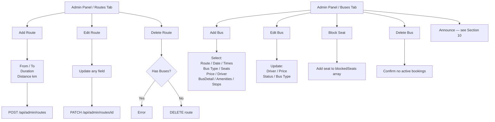
```mermaid
flowchart TD
    ROUTETAB[Admin Panel / Routes Tab]
    ROUTETAB --> ADDROUTE[Add Route]
    ROUTETAB --> EDITROUTE[Edit Route]
    ROUTETAB --> DELROUTE[Delete Route]

    ADDROUTE --> ROUTEFIELDS["From / To\nDuration\nDistance km"]
    ROUTEFIELDS --> POSTROUTE["POST /api/admin/routes"]

    EDITROUTE --> UPDATEFIELDS[Update any field]
    UPDATEFIELDS --> PATCHROUTE["PATCH /api/admin/routes/id"]

    DELROUTE --> HASBUSES{Has Buses?}
    HASBUSES -->|Yes| ROUTEERR[Error]
    HASBUSES -->|No| DELETEROUTE[DELETE route]

    BUSTAB[Admin Panel / Buses Tab]
    BUSTAB --> ADDBUS[Add Bus]
    BUSTAB --> EDITBUS[Edit Bus]
    BUSTAB --> BLOCKBUS[Block Seat]
    BUSTAB --> DELBUS[Delete Bus]
    BUSTAB --> ANNOUNCE[Announce — see Section 10]

    ADDBUS --> BUSFIELDS["Select:\nRoute / Date / Times\nBus Type / Seats\nPrice / Driver\nBusDetail / Amenities / Stops"]
    EDITBUS --> EDITFIELDS["Update:\nDriver / Price\nStatus / Bus Type"]
    BLOCKBUS --> BLOCKED[Add seat to blockedSeats array]
    DELBUS --> ACTIVECHECK[Confirm no active bookings]
```

---

## 7. Fleet Management — Bus Details

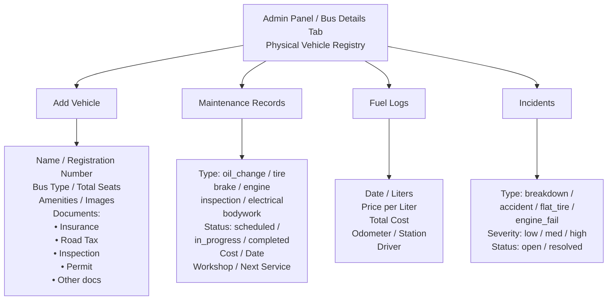
```mermaid
flowchart TD
    FLEETTAB[Admin Panel / Bus Details Tab\nPhysical Vehicle Registry]
    FLEETTAB --> ADDVEHICLE[Add Vehicle]
    FLEETTAB --> MAINTENANCE[Maintenance Records]
    FLEETTAB --> FUELLOGS[Fuel Logs]
    FLEETTAB --> INCIDENTS[Incidents]

    ADDVEHICLE --> VFIELDS["Name / Registration Number\nBus Type / Total Seats\nAmenities / Images\nDocuments:\n• Insurance\n• Road Tax\n• Inspection\n• Permit\n• Other docs"]

    MAINTENANCE --> MFIELDS["Type: oil_change / tire\nbrake / engine\ninspection / electrical\nbodywork\nStatus: scheduled /\nin_progress / completed\nCost / Date\nWorkshop / Next Service"]

    FUELLOGS --> FFIELDS["Date / Liters\nPrice per Liter\nTotal Cost\nOdometer / Station\nDriver"]

    INCIDENTS --> IFIELDS["Type: breakdown /\naccident / flat_tire /\nengine_fail\nSeverity: low / med / high\nStatus: open / resolved"]
```

---

## 8. Driver Management

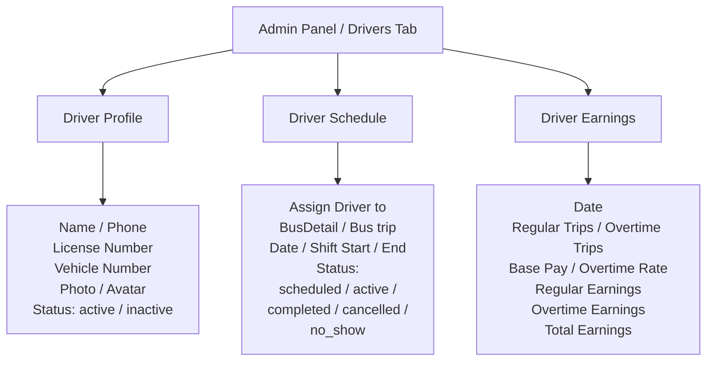
```mermaid
flowchart TD
    DRIVERTAB[Admin Panel / Drivers Tab]
    DRIVERTAB --> PROFILE[Driver Profile]
    DRIVERTAB --> SCHEDULE[Driver Schedule]
    DRIVERTAB --> EARNINGS[Driver Earnings]

    PROFILE --> PFIELDS["Name / Phone\nLicense Number\nVehicle Number\nPhoto / Avatar\nStatus: active / inactive"]

    SCHEDULE --> SFIELDS["Assign Driver to\nBusDetail / Bus trip\nDate / Shift Start / End\nStatus:\nscheduled / active /\ncompleted / cancelled /\nno_show"]

    EARNINGS --> EFIELDS["Date\nRegular Trips / Overtime Trips\nBase Pay / Overtime Rate\nRegular Earnings\nOvertime Earnings\nTotal Earnings"]
```

---

## 9. Employee & Payroll (HR)

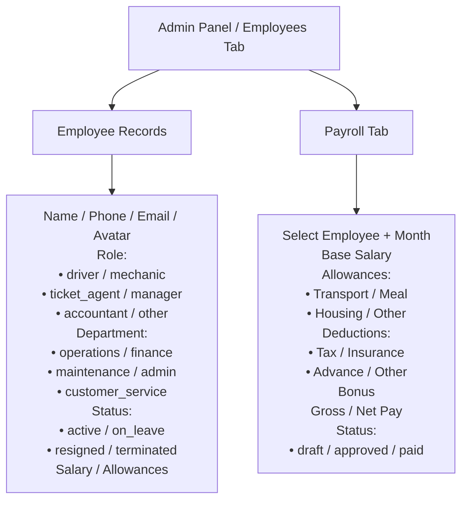
```mermaid
flowchart TD
    EMPTAB[Admin Panel / Employees Tab]
    EMPTAB --> EMPRECORDS[Employee Records]
    EMPTAB --> PAYROLLTAB[Payroll Tab]

    EMPRECORDS --> EMPFIELDS["Name / Phone / Email / Avatar\nRole:\n• driver / mechanic\n• ticket_agent / manager\n• accountant / other\nDepartment:\n• operations / finance\n• maintenance / admin\n• customer_service\nStatus:\n• active / on_leave\n• resigned / terminated\nSalary / Allowances"]

    PAYROLLTAB --> PAYFIELDS["Select Employee + Month\nBase Salary\nAllowances:\n• Transport / Meal\n• Housing / Other\nDeductions:\n• Tax / Insurance\n• Advance / Other\nBonus\nGross / Net Pay\nStatus:\n• draft / approved / paid"]
```

---

## 10. Announcement & Multi-Channel Notification

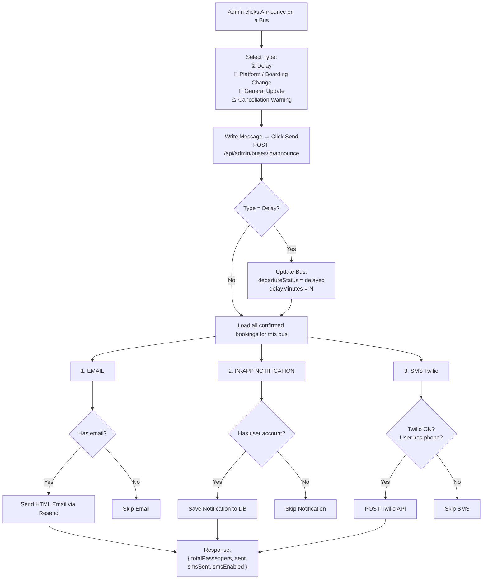
```mermaid
flowchart TD
    ANNOUNCECLICK[Admin clicks Announce on a Bus]
    ANNOUNCECLICK --> TYPE["Select Type:\n⏳ Delay\n📍 Platform / Boarding Change\n📢 General Update\n⚠️ Cancellation Warning"]
    TYPE --> SENDMSG["Write Message → Click Send\nPOST /api/admin/buses/id/announce"]
    SENDMSG --> ISDELAY{Type = Delay?}
    ISDELAY -->|Yes| UPDATEBUS["Update Bus:\ndepartureStatus = delayed\ndelayMinutes = N"]
    ISDELAY -->|No| LOADBOOK
    UPDATEBUS --> LOADBOOK

    LOADBOOK[Load all confirmed bookings for this bus]
    LOADBOOK --> EMAIL_CH[1. EMAIL]
    LOADBOOK --> INAPP_CH[2. IN-APP NOTIFICATION]
    LOADBOOK --> SMS_CH[3. SMS Twilio]

    EMAIL_CH --> HASEMAIL{Has email?}
    HASEMAIL -->|Yes| SENDEMAIL[Send HTML Email via Resend]
    HASEMAIL -->|No| SKIPEMAIL[Skip Email]

    INAPP_CH --> HASACCT{Has user account?}
    HASACCT -->|Yes| SAVENOTIF[Save Notification to DB]
    HASACCT -->|No| SKIPNOTIF[Skip Notification]

    SMS_CH --> TWILIOCHECK{"Twilio ON?\nUser has phone?"}
    TWILIOCHECK -->|Yes| POSTTWILIO[POST Twilio API]
    TWILIOCHECK -->|No| SKIPSMS[Skip SMS]

    SENDEMAIL --> RESP
    SAVENOTIF --> RESP
    POSTTWILIO --> RESP
    RESP["Response:\n{ totalPassengers, sent,\n  smsSent, smsEnabled }"]
```

---

## 11. In-App Notification Bell

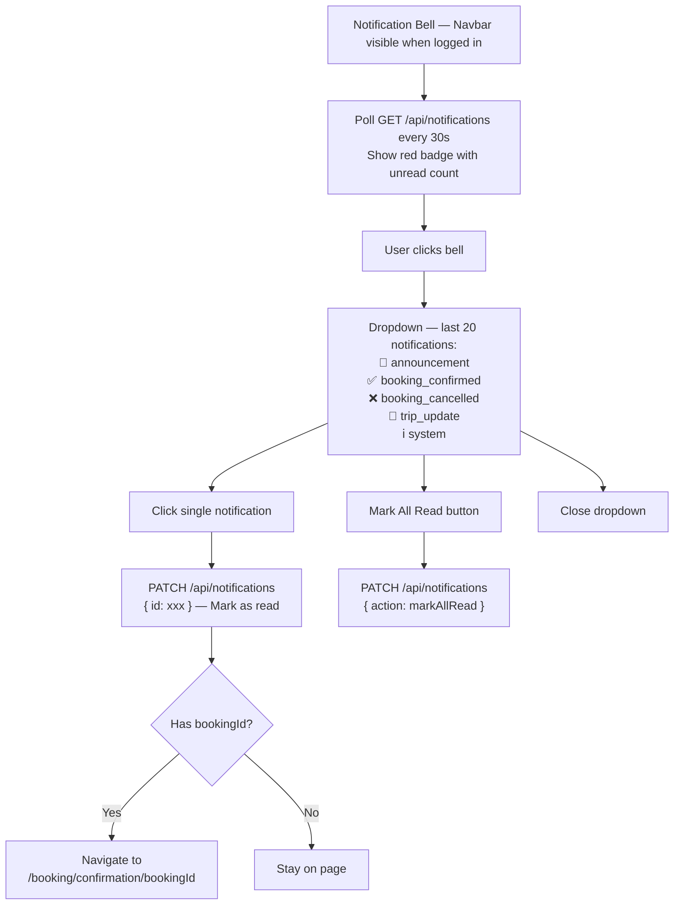
```mermaid
flowchart TD
    BELL[Notification Bell — Navbar visible when logged in]
    BELL --> POLL["Poll GET /api/notifications every 30s\nShow red badge with unread count"]
    POLL --> CLICKBELL[User clicks bell]
    CLICKBELL --> DROPDOWN["Dropdown — last 20 notifications:\n📢 announcement\n✅ booking_confirmed\n❌ booking_cancelled\n🚌 trip_update\nℹ️ system"]
    DROPDOWN --> SINGLE[Click single notification]
    DROPDOWN --> MARKALL[Mark All Read button]
    DROPDOWN --> CLOSE[Close dropdown]

    SINGLE --> PATCHONE["PATCH /api/notifications\n{ id: xxx } — Mark as read"]
    MARKALL --> PATCHALL["PATCH /api/notifications\n{ action: markAllRead }"]

    PATCHONE --> HASBOOKING{Has bookingId?}
    HASBOOKING -->|Yes| NAVCONF[Navigate to\n/booking/confirmation/bookingId]
    HASBOOKING -->|No| STAY[Stay on page]
```

---

## 12. User & Booking Admin Management

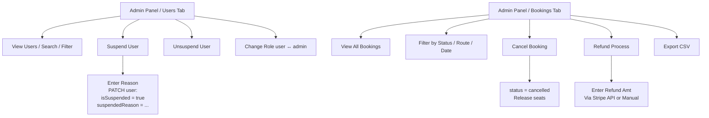
```mermaid
flowchart TD
    USERTAB[Admin Panel / Users Tab]
    USERTAB --> VIEWUSERS[View Users / Search / Filter]
    USERTAB --> SUSPEND[Suspend User]
    USERTAB --> UNSUSPEND[Unsuspend User]
    USERTAB --> CHANGEROLE[Change Role user ↔ admin]

    SUSPEND --> REASON["Enter Reason\nPATCH user:\nisSuspended = true\nsuspendedReason = ..."]

    BOOKTAB[Admin Panel / Bookings Tab]
    BOOKTAB --> VIEWALL[View All Bookings]
    BOOKTAB --> FILTER[Filter by Status / Route / Date]
    BOOKTAB --> CANCELBOOKING[Cancel Booking]
    BOOKTAB --> REFUND[Refund Process]
    BOOKTAB --> EXPORTCSV[Export CSV]

    CANCELBOOKING --> CANCELACTION["status = cancelled\nRelease seats"]
    REFUND --> REFUNDACTION["Enter Refund Amt\nVia Stripe API or Manual"]
```

---

## 13. Check-In System

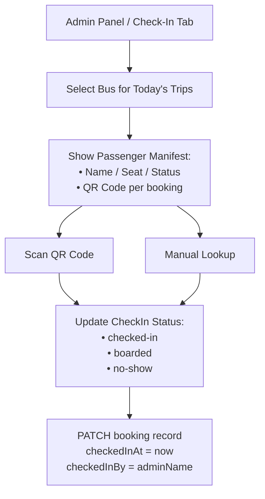
```mermaid
flowchart TD
    CHECKIN[Admin Panel / Check-In Tab]
    CHECKIN --> SELECTBUS[Select Bus for Today's Trips]
    SELECTBUS --> MANIFEST["Show Passenger Manifest:\n• Name / Seat / Status\n• QR Code per booking"]
    MANIFEST --> SCAN[Scan QR Code]
    MANIFEST --> MANUAL[Manual Lookup]
    SCAN --> UPDATE
    MANUAL --> UPDATE

    UPDATE["Update CheckIn Status:\n• checked-in\n• boarded\n• no-show"]
    UPDATE --> PATCH["PATCH booking record\ncheckedInAt = now\ncheckedInBy = adminName"]
```

---

## 14. Loyalty Points

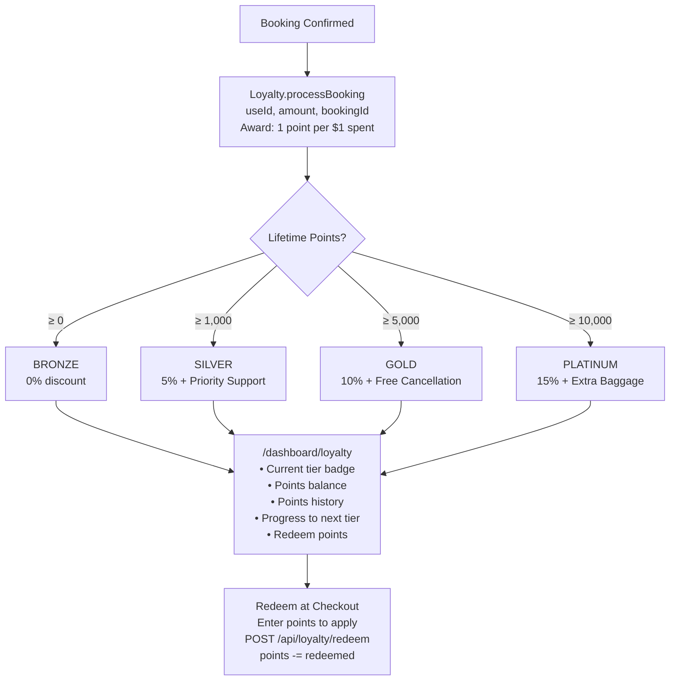
```mermaid
flowchart TD
    BOOKCONF[Booking Confirmed]
    BOOKCONF --> LOYALTY["Loyalty.processBooking\nuseId, amount, bookingId\nAward: 1 point per $1 spent"]
    LOYALTY --> TIER{Lifetime Points?}

    TIER -->|"≥ 0"| BRONZE["BRONZE\n0% discount"]
    TIER -->|"≥ 1,000"| SILVER["SILVER\n5% + Priority Support"]
    TIER -->|"≥ 5,000"| GOLD["GOLD\n10% + Free Cancellation"]
    TIER -->|"≥ 10,000"| PLATINUM["PLATINUM\n15% + Extra Baggage"]

    BRONZE --> LOYALTYPAGE
    SILVER --> LOYALTYPAGE
    GOLD --> LOYALTYPAGE
    PLATINUM --> LOYALTYPAGE

    LOYALTYPAGE["/dashboard/loyalty\n• Current tier badge\n• Points balance\n• Points history\n• Progress to next tier\n• Redeem points"]
    LOYALTYPAGE --> REDEEM["Redeem at Checkout\nEnter points to apply\nPOST /api/loyalty/redeem\npoints -= redeemed"]
```

---

## 15. Ratings & Reviews

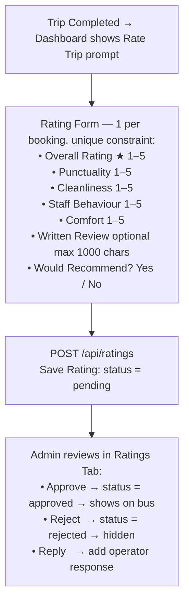
```mermaid
flowchart TD
    TRIPCOMP[Trip Completed → Dashboard shows Rate Trip prompt]
    TRIPCOMP --> RATINGFORM["Rating Form — 1 per booking, unique constraint:\n• Overall Rating ★ 1–5\n• Punctuality 1–5\n• Cleanliness 1–5\n• Staff Behaviour 1–5\n• Comfort 1–5\n• Written Review optional max 1000 chars\n• Would Recommend? Yes / No"]
    RATINGFORM --> POSTRATING["POST /api/ratings\nSave Rating: status = pending"]
    POSTRATING --> ADMINREVIEW["Admin reviews in Ratings Tab:\n• Approve → status = approved → shows on bus\n• Reject  → status = rejected → hidden\n• Reply   → add operator response"]
```

---

## 16. Promo Code Management

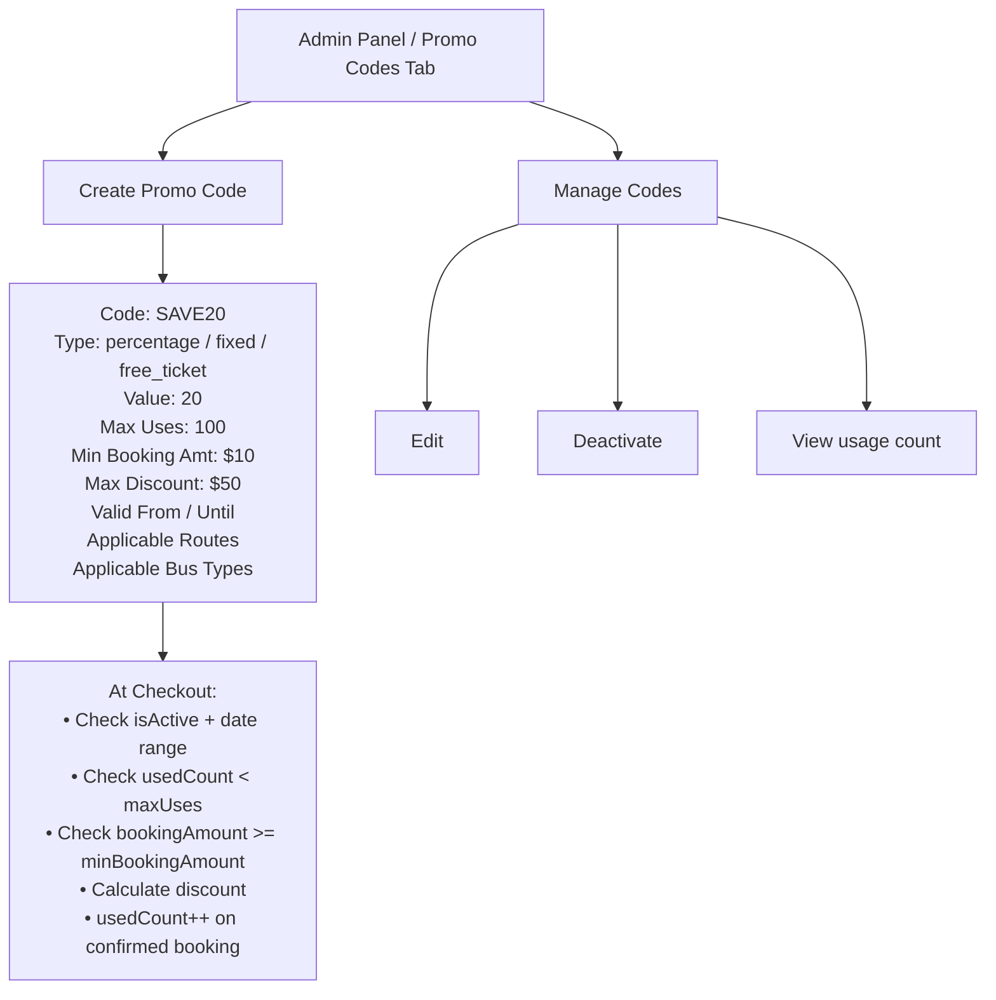
```mermaid
flowchart TD
    PROMOTAB[Admin Panel / Promo Codes Tab]
    PROMOTAB --> CREATE[Create Promo Code]
    PROMOTAB --> MANAGE[Manage Codes]

    CREATE --> CFIELDS["Code: SAVE20\nType: percentage / fixed / free_ticket\nValue: 20\nMax Uses: 100\nMin Booking Amt: $10\nMax Discount: $50\nValid From / Until\nApplicable Routes\nApplicable Bus Types"]

    MANAGE --> MEDIT[Edit]
    MANAGE --> MDEACT[Deactivate]
    MANAGE --> MUSAGE[View usage count]

    CFIELDS --> CHECKOUT["At Checkout:\n• Check isActive + date range\n• Check usedCount < maxUses\n• Check bookingAmount >= minBookingAmount\n• Calculate discount\n• usedCount++ on confirmed booking"]
```

---

## 17. Analytics & Reports

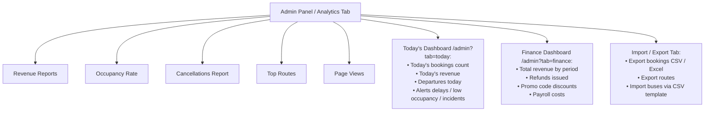
```mermaid
flowchart TD
    ANALYTAB[Admin Panel / Analytics Tab]
    ANALYTAB --> REVENUE[Revenue Reports]
    ANALYTAB --> OCCUPANCY[Occupancy Rate]
    ANALYTAB --> CANCELS[Cancellations Report]
    ANALYTAB --> TOPROUTES[Top Routes]
    ANALYTAB --> PAGEVIEWS[Page Views]

    ANALYTAB --> TODAY["Today's Dashboard /admin?tab=today:\n• Today's bookings count\n• Today's revenue\n• Departures today\n• Alerts delays / low occupancy / incidents"]

    ANALYTAB --> FINANCE["Finance Dashboard /admin?tab=finance:\n• Total revenue by period\n• Refunds issued\n• Promo code discounts\n• Payroll costs"]

    ANALYTAB --> IMPEXP["Import / Export Tab:\n• Export bookings CSV / Excel\n• Export routes\n• Import buses via CSV template"]
```

---

## 18. Lost & Found

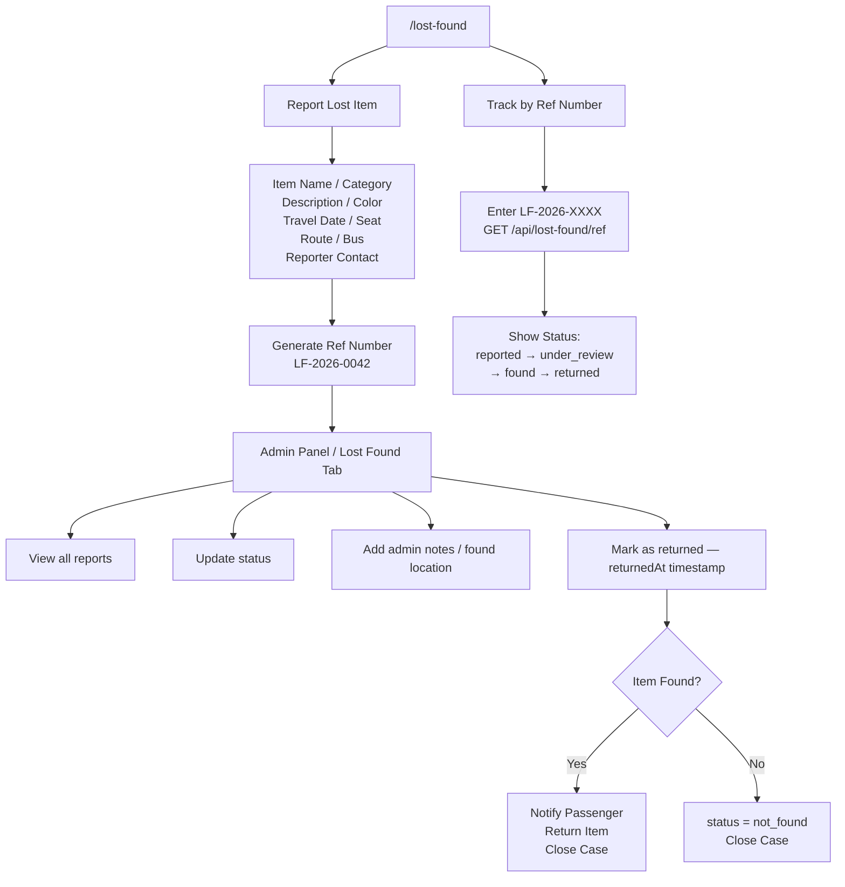
```mermaid
flowchart TD
    LOSTPAGE["/lost-found"]
    LOSTPAGE --> REPORTLOST[Report Lost Item]
    LOSTPAGE --> TRACKREF[Track by Ref Number]

    REPORTLOST --> LFIELDS["Item Name / Category\nDescription / Color\nTravel Date / Seat\nRoute / Bus\nReporter Contact"]
    LFIELDS --> GENREF[Generate Ref Number\nLF-2026-0042]
    GENREF --> ADMINLOST

    TRACKREF --> ENTERREF[Enter LF-2026-XXXX\nGET /api/lost-found/ref]
    ENTERREF --> SHOWSTATUS["Show Status:\nreported → under_review\n→ found → returned"]

    ADMINLOST[Admin Panel / Lost Found Tab]
    ADMINLOST --> VIEWREPORTS[View all reports]
    ADMINLOST --> UPDATESTATUS[Update status]
    ADMINLOST --> ADMINNOTES[Add admin notes / found location]
    ADMINLOST --> MARKRET[Mark as returned — returnedAt timestamp]
    MARKRET --> ITEMFOUND{Item Found?}
    ITEMFOUND -->|Yes| NOTIFYPASS["Notify Passenger\nReturn Item\nClose Case"]
    ITEMFOUND -->|No| NOTFOUND["status = not_found\nClose Case"]
```

---

## 19. Support Chat

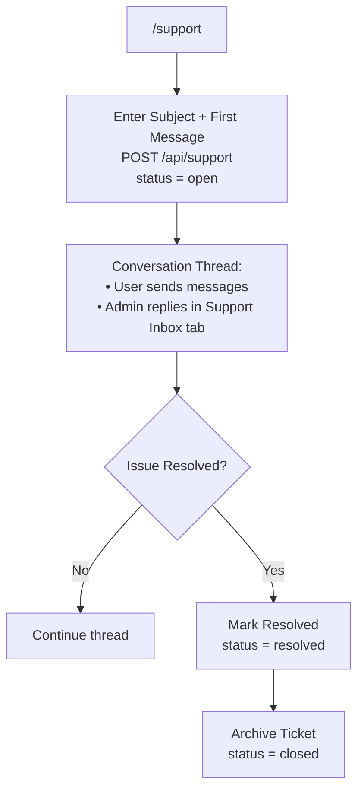
```mermaid
flowchart TD
    SUPPPAGE["/support"]
    SUPPPAGE --> FIRSTMSG["Enter Subject + First Message\nPOST /api/support\nstatus = open"]
    FIRSTMSG --> THREAD["Conversation Thread:\n• User sends messages\n• Admin replies in Support Inbox tab"]
    THREAD --> RESOLVED{Issue Resolved?}
    RESOLVED -->|No| CONTINUE[Continue thread]
    RESOLVED -->|Yes| MARKRES["Mark Resolved\nstatus = resolved"]
    MARKRES --> ARCHIVE["Archive Ticket\nstatus = closed"]
```

---

## 20. Security, Audit & System Settings

```mermaid
flowchart TD
    SETTINGSTAB[Admin Panel / Settings Tab]
    SETTINGSTAB --> GENERAL["General Settings:\nBusiness Name / Currency\nTimezone / Contact / Phone"]
    SETTINGSTAB --> BRANDING["Branding:\nUpload Logo PNG\nPreview / Remove Logo"]
    SETTINGSTAB --> BOOKINGRULES["Booking Rules:\nMax Seats / Cutoff\nCancel Window\nAutoConfirm / Upfront Pay"]
    SETTINGSTAB --> NOTIFALERTS["Notification Alerts:\nEmail Toggle\nAdmin Email\nNotify On Book\nNotify On Cancel"]
    SETTINGSTAB --> PAYKEYS["Payment Keys:\nStripe Keys\nABA Keys\nActive Gateway"]
    SETTINGSTAB --> SMSTWILIO["SMS / Twilio:\nTwilio SID / Auth / Token\nFrom Number"]
    SETTINGSTAB --> SECURITY["Security:\nChange Password"]

    AUDITTAB[Admin Panel / Audit Logs Tab]
    AUDITTAB --> AUDITLOG["Every admin action logged:\n• entityType: booking/bus/route/user/promo_code\n• action: create/update/delete/cancel/\n  refund/login/logout/bulk_import/bulk_export\n• userId / userName / userEmail\n• changes[]: { field, oldValue, newValue }\n• severity: low/medium/high/critical\n• metadata: ipAddress, userAgent\n• TTL: Auto-deleted after 1 year"]

    SYSTEMSTATUS[Admin Panel / System Status Tab]
    SYSTEMSTATUS --> HEALTH["GET /api/health:\n• MongoDB connection ✅ / ❌\n• Email service Resend ✅ / ❌\n• Payment gateway status\n• Server uptime\n• Environment: development / production"]
```

---

## 21. User Dashboard

```mermaid
flowchart TD
    DASH["/dashboard"]
    DASH --> MYBOOKINGS[My Bookings\n/dashboard/bookings]
    DASH --> LOYALTYPAGE[Loyalty Points\n/dashboard/loyalty]
    DASH --> PROFILE[Profile\n/dashboard/profile]

    MYBOOKINGS --> UPCOM[Upcoming trips]
    MYBOOKINGS --> PAST[Past trips]
    MYBOOKINGS --> CANCBOOKINGS[Cancelled]
    MYBOOKINGS --> VIEWTICKET[View ticket]
    MYBOOKINGS --> DLPDF[Download PDF]
    MYBOOKINGS --> CANCELBOOKING[Cancel booking]
    MYBOOKINGS --> RATETRIP[Rate trip]
    MYBOOKINGS --> WAITLIST[View waitlist]

    LOYALTYPAGE --> LPOINTS[Points balance]
    LOYALTYPAGE --> LTIER[Tier badge]
    LOYALTYPAGE --> LHIST[Points history]
    LOYALTYPAGE --> LBENEFITS[Benefits list]
    LOYALTYPAGE --> LPROG[Progress bar]
    LOYALTYPAGE --> LREDEEM[Redeem button]

    PROFILE --> EDITNAME[Edit Name]
    PROFILE --> CHANGEPHONE[Change Phone]
    PROFILE --> AVATAR[Upload avatar]
    PROFILE --> CHANGEPWD[Change password]
    PROFILE --> NOTIFPREF[Notification preferences]
    PROFILE --> SAVEDPASS[Saved passengers]
```

---

## System Data Flow Summary

```mermaid
graph LR
    USER --> LOYALTY_1["LOYALTY 1:1"]
    USER --> NOTIF_1["NOTIFICATION 1:N"]
    USER --> RATING_1["RATING 1:N"]
    USER --> WAITLIST_1["WAITINGLIST 1:N"]
    USER --> SUPPORT_1["SUPPORTCONVERSATION 1:N"]
    USER --> LOST_1["LOSTFOUND 1:N"]

    USER --> BOOKING
    BOOKING --> NOTIF_2[NOTIFICATION]
    BOOKING --> RATING_2["RATING 1:1"]
    BOOKING --> LOSTFOUND[LOSTFOUND]
    BOOKING --> PENDBOOKING["PENDINGBOOKING TTL 30m"]

    ROUTE --> BUS
    BUS --> DRIVER
    BUS --> BUSDETAIL
    BUSDETAIL --> MAINTENANCE
    BUSDETAIL --> FUELLOG
    BUSDETAIL --> INCIDENT
    BUSDETAIL --> DRIVERSCHEDULE
    BUS --> DRIVEREARNING

    EMPLOYEE --> PAYROLL
    PROMOCODE -->|optional| ROUTE
    AUDITLOG["AUDITLOG TTL 1yr"]
    PAGEVIEW[PAGEVIEW analytics]
    SETTINGS[SETTINGS singleton]
```
